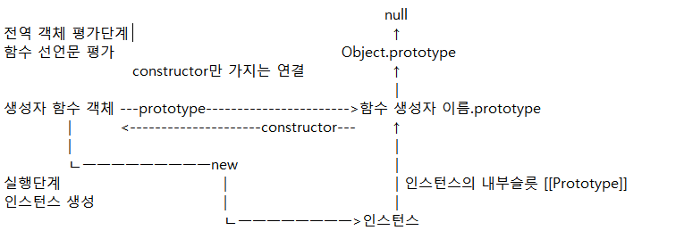

# 2021.11.11 [11일차]

오늘은 러버덕을 통해 prototype과 실행 컨텍스트, 빌트인 객체, this등을 공부했다.  
특히 this를 비롯한 prototype과 실행컨텍스트의 내용이 전부 연결되어 있는 내용이라 한번에 묶어서 공부 하는게 좋을것 같다는 생각이 들었다 주말에 반드시 복습해야할 영역이다.  
특히 처음 이 영역을 공부할때 따로 공부하려고 하니 이해가 잘 되지 않았었는데 강사님이 여러번 다시 설명해주시면서 머리속에 개념이 잡힌것 같다. 한번더 확실하게 익히고 이해가 가지 않는 부분은 다음주에 발표를 통해 틀린점이 있다면 지적받아야 할 것 같다.


## 공부한 내용

- 코드 흐름에 따른 실행 컨텍스트의 생성 과정과 렉시컬 스코프의 연결이 어떻게 이루어지는지 알았다.  
- 또한 prototype의 생성 과정을 차근히 다시 들을 수 있었다. prototype을 좀만 더 파보면 머리속에 그림이 확실히 잡힐 것 같다.  
- 정적 메서드는 prototype을 사용하지 않는다. this가 필요 없기 때문이다.

## 학습 결과물

학습 결과물은 같이 포함된 파일에 동봉되었으며 각 TIL의 목록별 소제목에 링크가 달려있다.

### 강의 학습 현황

\> 21~23강 러버덕, 프로그래머스 1, 2단계 문제풀이

## 질의응답

비트 연산자는 가독성이 크게 떨어진다. 따라서 실무에서 사용하기 힘들기 때문에 사용을 자제할것  
서버와 클라이언트의 통신으 URI를 통한 HTTP로 통신한다.  
전역 빌트인 객체는 JS 초창기때 많이 쓰일것으로 예상된 객체들이다.  

Math.max -> max는 프로토타입 체인상 어디에 존재하는가?  
Math의 메서드로 존재한다.

실행컨텍스트 
- 스코프와 실행순서 관리
  - 스코프는 식별자 관리 (식별자만들어있다)
  - 실행컨텍스트가 실행순서 관리

식별자는 스코프(실행컨텍스트의 렉시컬환경)에서 찾는다.  
메서드는 찾은 객체에서 찾는다. (프로토타입체인을 따라감)  
Math.max = Math는 생성자 함수가 아님, Math라는 인스턴스는 없다.  
String.prototype.charAt() -> String.prototype = 스트링 인스턴스가 필요함 + 스트링은 생성자 함수이다.    

### 내가 직접 그려본 생성자 함수와 인스턴스, 프로토 타입의 구조



정적 메서드  
- this를 쓰지 않는 메서드는 정적(static)으로 만든다.
- this는 인스턴스를 참조하기 위해 만든것이므로 정적메서드에서는 필요없다.  
```js
function Person(name){
  this.name = name;
}
Person.hello = function (){console.log('hello')}; // 정적 메서드, this를 사용하지 않음
```
정적 메서드 (static method) 변하지 않는 '상수'  
prototype method 에는 this를 반드시 써야한다.  

## 프로그래머스 문제 풀이
### 3진법 뒤집기
10진법 - 3진법 - 앞뒤 반전 - 10진법으로 변환하는 문제이다.
```js
// 주어진 숫자를 3진법으로 바꾸고 배열화 한뒤 뒤집고 다시 문자열로 만든뒤 10진수로 변환했다.
function solution(n) { 
  return parseInt(n.toString(3).split('').reverse().join(''), 3);
}
```
### 구명보트
무게 제한이 있고 최대 2명이 탑승 가능한 구명보트를 최소로 사용하여 사람을 탈출 시키는 문제
```js
function solution(people, limit) {
  let answer = 0;
  // 사람들을 몸무게 순으로 정렬
  const peoples = people.sort((x,y)=> x-y);
  // 보트
  const boat = [];
  // 가장 가벼운 사람을 태우고 뒤에서부터 검사를 진행
  while(peoples.length){
    // 가장 가벼운 사람 탑승
    boat.push(peoples.shift());
    // 가장 무거운 사람부터 순차적으로 검사 함께 탈 수 없다면 무조건 혼자탄다
    for(let i = peoples.length-1; i >= 0; i--){
      // 혼자 탄다
      if(peoples[i] > limit - boat[0]){
        peoples.pop();
        answer++;
      }else{ // 함께 탄다
        boat.pop();
        peoples.pop();
        answer++;
        break;
      }
    }
    // 현재 가장 가벼운사람이 혼자 탈 경우
    if(boat.length) {
      boat.pop();
      answer++;
    }
  }
  // 반환
  return answer;
}
```
### 큰 수 만들기
주어진 숫자에서 k개의 수를 제거했을때 얻을 수 있는 가장 큰 수를 구해야한다.  
수를 지우는 위치는 자유지만 기존의 순서는 유지해야한다.
```js
// 스택을 이용해서 풀었다.
function makeBiggestNumber(number, k) { // number : String, k = Number
  const stack = []; // 스택 선언
  let delNumber = k; // 남은 수를 점검할 변수

  for (const value of number) { // 모든 값 탐색
    if (delNumber) { // delNumber가 0이 아니면 진입
      // stack이 비어있으면 NaN, NaN와 Number의 비교는 무조건 false
      if (value > stack[stack.length - 1]) {
        // 작은 수 가 앞에 있으면 지워내기
        while (value > stack[stack.length - 1] && stack.length) {
          stack.pop();
          delNumber--;
          // 여기서 delNumber가 0이 되면 중단해야함
          if (!delNumber) break;
        }
      }
    }
    // 지울 수 없다면 push한다
    stack.push(value);
  }
  // 모든 로직을 진행한 후 아직 지울 숫자가 남았다면 뒤부터 순서대로 삭제
  while(delNumber) {
    stack.pop();
    delNumber--;
  }
  return stack.join(''); // 스택을 문자열로 바꿔서 반환한다.
}
```


